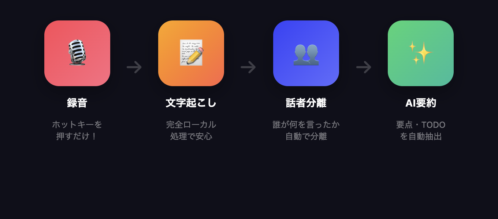
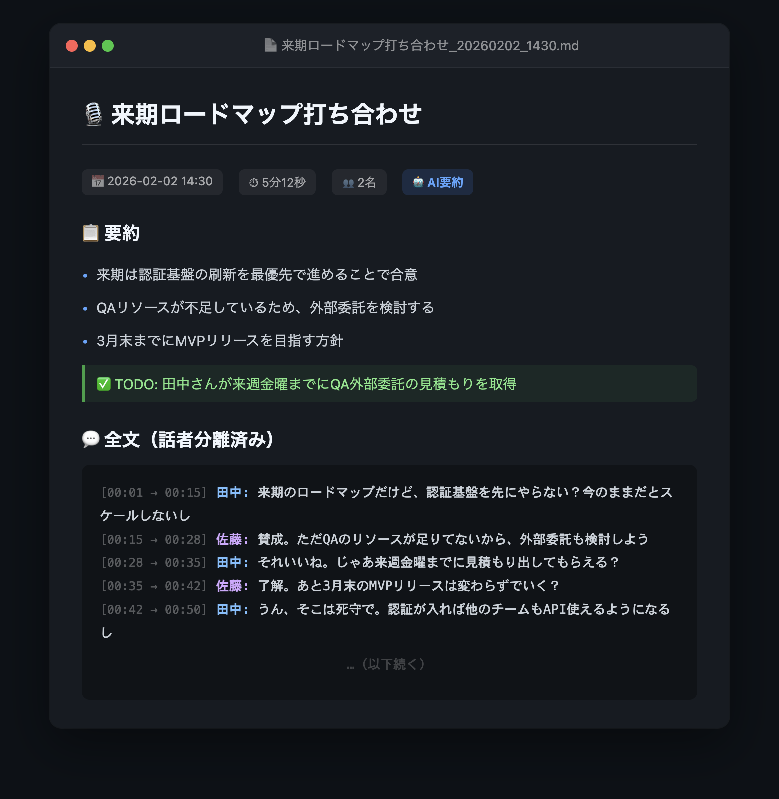
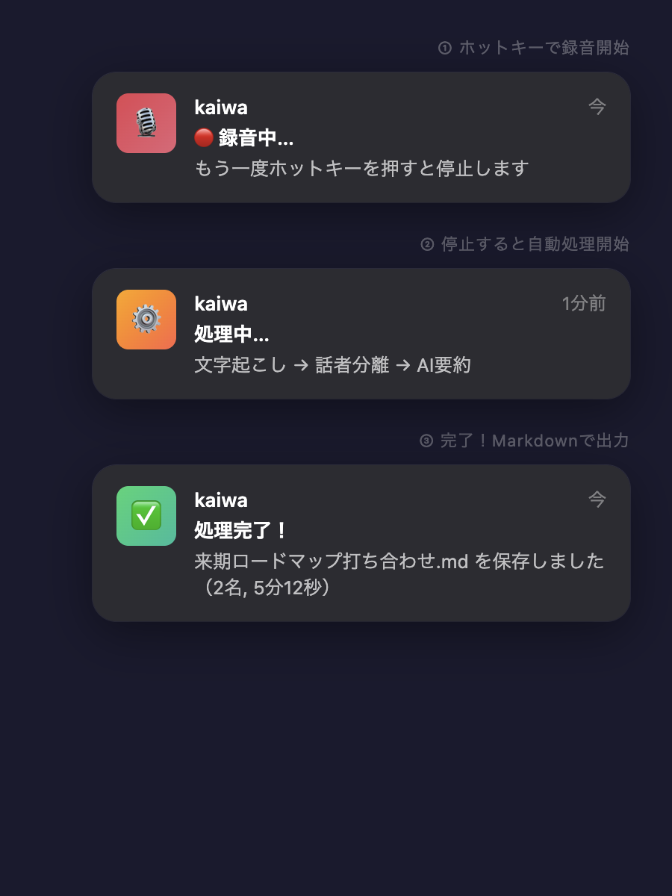

# 🎙️ kaiwa（会話）

[](https://github.com/takayama-tigrit/kaiwa/actions/workflows/test.yml)
[](https://github.com/takayama-tigrit/kaiwa/actions/workflows/security.yml)
[](https://opensource.org/licenses/MIT)

**デスクで突発的に始まる会話、ちゃんと記録できてますか？**

ZoomやTeamsにはtl;dvやOtter.aiがあります。でも、「ちょっといいですか？」でデスクで始まった会話には何もない——kaiwaは、その**「録れなかった会話」を録るため**に作ったOSSツールです！

ホットキーを押すだけで、**録音 → 文字起こし → 話者分離 → AI要約** を全自動で行います。



---

## 📄 こんなMarkdownが自動で出てきます！

ホットキーで録音を停止すると、こんな感じの見やすいMarkdownファイルが自動で保存されます👇



**要約・TODO・話者分離済み全文**が全部入ったMarkdownファイル。これがホットキー1つで手に入ります！

macOSの通知で処理の進捗もリアルタイムにわかります👇



---

## 💰 利用料金

**kaiwa 自体は完全無料です。** ソフトウェアの利用料・サブスク・ライセンス費用は一切かかりません。

唯一かかるコストは、要約に使う **Claude API の従量課金**だけ。あなたが自分の Anthropic アカウントで API キーを発行し、使った分だけ支払う仕組みです。kaiwa に対してお金を払う必要はありません。

> 💡 文字起こし（WhisperX）と話者分離（pyannote）はすべてローカルで動作するため、API 料金は**要約の1ステップだけ**です。要約が不要なら API キーなしでも使えます（完全無料）。

### 📊 月額シミュレーション（1日2時間 × 週5日）

| 項目 | 計算 | コスト |
|------|------|--------|
| 使用モデル | Claude 3.5 Haiku | — |
| 1回あたりの入力 | 要約プロンプト + 文字起こし全文 ≈ 20,000トークン | $0.016 |
| 1回あたりの出力 | 要約テキスト ≈ 1,000トークン | $0.004 |
| **1回あたり合計** | | **約 $0.02（≈ ¥3）** |
| 1日あたり（2時間 = 1回） | | 約 ¥3 |
| **月額（22営業日）** | ¥3 × 22日 | **約 ¥66/月** |

> **参考**: 1時間の会話 ≈ ¥1.5〜2、30分の打ち合わせ ≈ ¥1 程度
>
> **料金根拠**: Claude 3.5 Haiku — 入力 $0.80/百万トークン、出力 $4.00/百万トークン（[Anthropic公式](https://docs.anthropic.com/en/docs/about-claude/models)）

### 他サービスとの年間コスト比較

| | 年間コスト | 内訳 |
|---|---|---|
| **kaiwa** | **約 ¥800** | Claude API のみ（¥66/月 × 12） |
| Plaud Note Pro + プロプラン | ¥44,300〜 | デバイス ¥27,500 + 年額 ¥16,800 |
| Plaud Note Pro + スタータープラン | ¥27,500 | デバイス代のみ（月300分まで無料） |

> ⚠️ kaiwa は録音に Mac/iPhone のマイクを使うため、録音品質では専用デバイスに劣ります。用途に応じて選択してください。

---

## ✨ 特徴

- **高精度な話者分離** — faster-whisper の cross-attention ベース word timestamps + pyannote.audio で、会話のやり取りを話者ごとに正確に分離
- **完全ローカル処理** — 文字起こしと話者分離はすべて Mac 上で動作。音声データが外部に送信されることはありません
- **AI 要約** — Claude が会話の要点・決定事項・TODOを自動抽出
- **ワンアクション録音** — ホットキー一発で録音開始/停止、停止後に自動処理
- **iPhone 連携** — iCloud / Google Drive / Dropbox 経由でスマホ録音を自動処理

### Plaud Note Pro との違い

[Plaud Note Pro](https://jp.plaud.ai/) は高品質なAIボイスレコーダーで、専用ハードウェア・4つのMEMSマイク・GPT-5.1ベースの要約など、**完成度の高いオールインワン体験**を提供しています。

kaiwa は、そんな Plaud Note Pro のような体験を**初期投資ゼロ・低ランニングコスト**で実現したい人のためのOSSツールです。

| | Plaud Note Pro | kaiwa |
|---|---|---|
| **初期費用** | ¥27,500〜（専用デバイス） | 無料（Mac + マイクで動作） |
| **ランニングコスト** | スタータープラン無料（月300分）/ プロプラン 年16,800円 | Claude API 従量課金のみ（約¥66/月 — [詳細](#-利用料金)） |
| **手軽さ** | ◎ ボタン一つで録音→自動要約 | △ 初期セットアップが必要 |
| **録音品質** | ◎ 専用マイク4基、5m収音 | Mac/iPhoneのマイク依存 |
| **文字起こし** | クラウド（GPT-5.1） | ローカル（faster-whisper） |
| **話者分離** | ○ | ○（pyannote.audio + セグメント再分割） |
| **要約** | ◎ 10,000+テンプレート、多角的要約 | カスタマイズ自由（Claude） |
| **データ管理** | クラウド（ISO 27001/GDPR準拠） | 完全ローカル |
| **カスタマイズ** | テンプレート選択・用語集登録 | プロンプト・モデル等フルコントロール |

> 💡 **kaiwa はこんな人向け**: 手持ちのMacとマイクで、サブスクなしで文字起こし+要約がしたい人。Plaud Note Pro は完成度と手軽さで圧倒的なので、予算があるなら素直にそちらがおすすめです。

## 📄 出力例

> 出力イメージは[こちら（上部のプレビュー画像）](#-こんなmarkdownが自動で出てきます)をご覧ください！

<details>
<summary>テキスト版の出力例を見る</summary>

```markdown
# 病院とネイルの日常会話

## 📋 要約
- SPEAKER_00は実家でホログラムのネイルを1時間かけて行った
- 病院でうなじの皮膚の弱い部分に薬をもらった
- SPEAKER_01はエージェントとの面談で自身の目的を明確に説明できなかった
- **TODO**: 次回の面談で動機をより明確に説明する

## 💬 全文（話者分離済み）
[00:01 → 00:04] SPEAKER_01: 今日どうだったの? 実家行って何してたの?
[00:04 → 00:06] SPEAKER_00: ネイルをしていました
[00:06 → 00:07] SPEAKER_01: 自分で?
[00:07 → 00:07] SPEAKER_00: そう
[00:08 → 00:10] SPEAKER_01: 先端がかっこよくない?
[00:10 → 00:11] SPEAKER_00: キラキラしてるの
...
```

</details>

## 🚀 クイックスタート

### 必要環境
- macOS (Apple Silicon 推奨)
- Python 3.10+
- Homebrew

### インストール

```bash
git clone https://github.com/takayama-tigrit/kaiwa.git
cd kaiwa
./setup.sh
```

### 初期設定

HuggingFace トークンと Anthropic API キーを macOS Keychain に登録します。

```bash
security add-generic-password -a kaiwa -s hf-token -w 'hf_YOUR_TOKEN'
security add-generic-password -a kaiwa -s anthropic-api-key -w 'sk-ant-YOUR_KEY'
```

> 📖 詳細な手順（HFアカウント作成、モデルライセンス同意）: [docs/SETUP.md](docs/SETUP.md)

## 🎤 使い方

### ホットキーで録音（Mac）

ホットキーを押すだけで録音開始/停止。停止後に自動で文字起こし＋要約。

1. ホットキーを設定（3つの方法から選択）
2. ホットキー → 🔴 録音開始
3. もう一度 → ⏹ 停止 → 自動処理 → Markdown出力

> 📖 ホットキーの設定方法: [docs/HOTKEY.md](docs/HOTKEY.md)

### コマンドラインで処理

```bash
PYTHONPATH=./src ~/.kaiwa/venv/bin/python -m kaiwa.cli process recording.wav
```

### iPhone連携

iPhoneで録音 → クラウドストレージ経由で Mac に自動同期 → 自動処理。iCloud / Google Drive / Dropbox に対応。

```bash
./scripts/install-daemon.sh  # 監視デーモン有効化
```

> 📖 詳細な設定: [docs/CONFIGURATION.md](docs/CONFIGURATION.md#iphone--スマホ連携クラウドストレージ監視)

## ⚙️ 設定

設定ファイル `~/.kaiwa/config.yaml` で、モデル、保存先、クラウドストレージ連携などをカスタマイズできます。

> 📖 設定リファレンス: [docs/CONFIGURATION.md](docs/CONFIGURATION.md)

主な設定項目:
- **保存先の変更** — Google Drive や任意のフォルダに出力可能
- **クラウドストレージ監視** — iCloud / Google Drive / Dropbox
- **モデル / 言語** — WhisperX のモデルや言語を変更
- **要約 AI** — Claude のモデルやリトライ回数

## 📖 ドキュメント

| ドキュメント | 内容 |
|------------|------|
| [SETUP.md](docs/SETUP.md) | インストール・初期設定の詳細 |
| [HOTKEY.md](docs/HOTKEY.md) | ホットキー設定（Raycast / ショートカット / Automator） |
| [CONFIGURATION.md](docs/CONFIGURATION.md) | 設定ファイルの全リファレンス |
| [ARCHITECTURE.md](docs/ARCHITECTURE.md) | システム設計・データフロー |
| [TROUBLESHOOTING.md](docs/TROUBLESHOOTING.md) | よくある問題と解決策 |

## 🤝 コントリビュート

PRやIssueを歓迎しています！詳細は [CONTRIBUTING.md](CONTRIBUTING.md) をご覧ください。

## 📄 ライセンス

[MIT License](LICENSE) — Copyright (c) 2026 takayama-tigrit

サードパーティライセンスの詳細: [NOTICE.md](NOTICE.md)

## 🙏 謝辞

- [WhisperX](https://github.com/m-bain/whisperX) — 高精度な文字起こし + 話者分離統合
- [pyannote.audio](https://github.com/pyannote/pyannote-audio) — 話者分離エンジン
- [Anthropic Claude](https://www.anthropic.com/) — AI 要約
- [sox](https://sox.sourceforge.net/) — 録音
- [fswatch](https://github.com/emcrisostomo/fswatch) — ファイル監視
